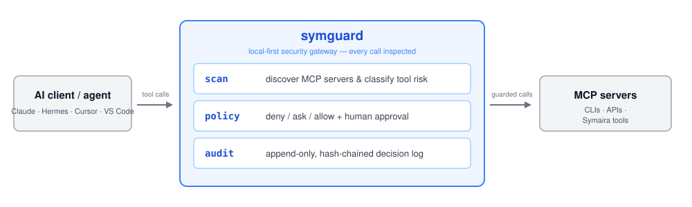

# Symaira Guard (`symguard`)

> A local-first security gateway for AI agents, MCP servers, and Symaira toolchains.

**Human control for agent autonomy.**

[](https://github.com/danieljustus/symaira-guard/actions/workflows/ci.yml)
[](https://go.dev/)
[](https://github.com/danieljustus/symaira-guard/blob/main/LICENSE)



---

## What

`symguard` sits between AI clients and the tools they call. It inspects every MCP tool call, classifies risk, enforces local policy, asks for human approval when needed, and records tamper-evident audit trails.

```
AI client / agent  →  symguard  →  MCP servers / CLIs / APIs / Symaira tools
```

The agent still gets useful tools. The human keeps enforceable boundaries.

## Why

MCP solved interoperability between AI clients and tool servers. It did not solve:

- Tool poisoning and rug-pull attacks (changed tool descriptions)
- Prompt injection escalating into tool calls
- Unbounded shell / filesystem / network / secret access
- Missing human approval for risky operations
- Secret exfiltration through tool output
- Cross-agent delegation risk

`symguard` is the missing local control layer.

## Current status (implemented today)

`symguard` is an early but working CLI:

```bash
$ symguard --help
symguard — local-first security gateway for AI agents

Usage:
  symguard <command> [flags]

Commands:
  version   Print version and build info
  doctor    Check system health and configuration
  decide    Read a JSON decision request from stdin, write the decision to stdout
  grants    List and revoke standing grants
  scan      Discover MCP servers across supported AI clients
  help      Show this help message

Run 'symguard <command> --help' for details on a specific command.

$ symguard version
symguard dev
  go      go1.26.5
  os/arch darwin/arm64
  built   2026-01-01 (compile-time placeholder)

$ symguard doctor
symguard doctor

  Version:   dev
  Go:        go1.26.5
  OS/Arch:   darwin/arm64

  binary           ok
  go runtime       ok
  config           not configured (no config file found)
  policy           defaults only (no rules — deny by default)
  audit log        not initialized (created on first 'symguard decide')
  spawn allowlist  not configured (empty — deny by default)
  mcp servers      none discovered

All basic checks passed. Run 'symguard scan' after setup for full diagnostics.
```

`doctor` prints static health checks plus two live diagnostics: the
[spawn allowlist](docs/config/spawn-allowlist.md) verdict for every
discovered stdio MCP server, and plaintext-secret risks in their configs.
It reports and gates — it is not a secret store (resolution stays with
`symvault`). The example above shows a machine without MCP configs; when
servers are discovered, each gets its own verdict line and the final
verdict reports the issue count instead.

Beyond the CLI, these subsystems are shipped as internal packages:
`internal/config` (TOML schema with fail-closed validation),
`internal/discovery` (MCP config discovery for Hermes/Claude
Desktop/Cursor/VS Code/OpenCode), `internal/policy` (deny/allow/require
rule buckets with rule tracing, evaluated by `symguard decide`),
`internal/sequence` (opt-in loop detection), `internal/capability`
(purpose-bound capability tokens), `internal/spawn` (deny-by-default
launch allowlist), `internal/proposal` (persisted policy-change requests),
`internal/grant` (enumerable, scoped, revocable grant store — `symguard
grants`), and `internal/audit` (hash-chained audit log with truncation
anchors), plus `internal/approval`, `internal/model`, `internal/output`,
`internal/update`, and `internal/archguard` (import-direction guard).

Still **design intent, not shipped**: the MCP proxy, schema pinning, and
remote access — sections 3, 4, and 6 below.

## What it does

### 1. Scan — implemented (`symguard scan`)

Discover MCP servers configured across local AI clients and classify their tools by risk.

```bash
symguard scan                 # scan all clients (table on a TTY, JSON otherwise)
symguard scan --format json   # machine-readable output
symguard scan --format table  # force human-readable output
```

The inventory is written to stdout with environment values redacted;
clients or entries that could not be mapped are reported as findings on
stderr.

### 2. Policy — implemented (`internal/policy`, exposed via `symguard decide`)

Define local rules that decide what gets through:

```toml
[defaults]
shell = "ask"
read_secret = "deny"
write_file = "ask"

[[rules]]
match.server = "symmemory"
match.tool = "memory_search"
decision = "allow"

[[rules]]
match.command_contains = ["rm -rf", "curl | sh"]
decision = "deny"

# Optional: stateful repetition detector (off by default).
# Blocks the Nth in-window call with the same tool+input (default 3) and
# fuzzy-matches near-identical searches. Denies are recoverable — the agent
# can retry with a different call; the session is never aborted.
[sequence]
enabled = false
threshold = 3
```

Decisions: `allow`, `ask`, `deny`, `redact`, `readonly`, `sandbox`. The TOML
schema lives in `internal/config`; `internal/policy` evaluates rules as
deny/allow/require buckets with a fail-closed decision contract and rule
tracing, and `symguard decide` exposes that engine over JSON stdin/stdout
for external classifiers (see Usage). The sequence detector lives in
`internal/sequence` and is exposed to the policy layer via
`policy.NewSequenceRule`; per-call enforcement inside a live proxy lands
with the interception path.

### 3. Proxy — design intent, not yet shipped

Run as an MCP proxy that enforces policy per tool call:

```bash
symguard proxy --config ~/.config/symguard/config.toml
```

Each tool call is classified, policy-checked, optionally approved by a human, then forwarded upstream. Sensitive output can be redacted before it reaches the agent.

### 4. Pin — design intent, not yet shipped

Store hashes of MCP tool descriptions and schemas. If a tool's description changes (hidden instructions, scope expansion), `symguard` flags it:

```
WARNING: Tool schema changed for server "filesystem" tool "read_file".
Policy: require re-approval
```

### 5. Audit — implemented (`internal/audit`)

Append-only local audit log with hash chaining. Records what was requested, which policy matched, who approved, what executed, and what came back.

Hash chaining on its own only guards against **modifying** a retained entry —
it does not stop **truncating** the log (deleting the most recent entries
outright; a chain check over what remains still passes, because nothing
anchors how many entries should exist). `internal/audit` implements both
guarantees:

- **Modification detection** — the hash chain.
- **Truncation detection** — an external `ChainAnchor` checkpoint file
  (`.anchor`) records the last entry hash and total entry count after every
  write. On verification the anchor's count must match the observed entries.
  The anchor file should be stored with stricter permissions than the log
  itself; on Linux, `chattr +a` (append-only) prevents its deletion.

Until the anchor file is stored on a separate volume or with OS-level
append-only protection, truncation detection is robust against casual
tampering but not against a privileged attacker who can delete both files.
Document this limitation in deployments that accept it.

### 6. Remote access — design intent, not yet shipped

Later phases add agent-aware remote MCP access over existing transports (SSH, Tailscale, LAN/mDNS) — not a new VPN, but policy and audit on top of tools you already trust.

## Risk classes

| Risk | Examples | Default |
|------|----------|---------|
| `read_public` | docs, README, public web | allow |
| `read_private` | repo files, notes, local docs | allow or ask |
| `read_secret` | `.env`, SSH keys, vault entries | ask / deny |
| `write_file` | patch, overwrite, create file | ask |
| `shell` | command execution | ask |
| `network` | outbound API / web requests | ask |
| `browser` | cookies, sessions, web automation | ask |
| `credential_use` | using secrets without revealing them | ask once / scoped |
| `deploy` | release, push, infra mutation | ask every time |
| `destructive` | delete, wipe, reset, revoke | ask / deny |

The table above classifies a tool by its **name** alone — a necessary first
pass, but not sufficient on its own. `scan`'s risk classifier additionally
caps a tool's risk *downward* (never up) when the tool grants **zero marginal
capability** beyond one the same client already holds via another tool
already resolved to `allow` in that session. Example: a `read_file` tool
classifies as `read_private` above, but if the same client already has an
unrestricted `shell` tool resolved to `allow`, `read_file` grants no
capability `shell` didn't already grant — cat is a strict subset of shell —
so `scan` caps it down to `allow` and states why
(`no marginal capability over already-allowed tool: shell`). If `shell`
itself is `ask` or `deny`, `read_file` keeps its `read_private` classification
unchanged.

## Symaira ecosystem position

`symguard` is a **public, self-hosted core** tool. No Pro, tenant, or billing code.

```
┌─────────────────────────────────────────┐
│ AI clients / agents                     │
│ Hermes · Claude · Cursor · OpenCode ... │
└───────────────────┬─────────────────────┘
                    ▼
            ┌──────────────┐
            │  symguard    │  ← trust boundary
            └──────┬───────┘
                   ▼
    symvault · symmemory · symscope · symseek · ...
```

Optional runtime integrations, no compile-time dependencies on siblings.

## Principles

- **Local-first.** Policy decisions happen on your machine. No mandatory cloud account.
- **Boring is good.** No custom VPN, no NAT traversal, no WireGuard daemon. Reuse existing transports.
- **Discovery ≠ trust.** Finding a remote MCP server never auto-implies permission.
- **Agent identities.** Agents and runs are first-class identities with TTL and scoped grants.
- **Explainable.** Every decision has a reason. Simulate before acting. Diagnose after failing.

## Non-goals

Not a chat frontend, not a SIEM, not a cloud-only SaaS, not a VPN replacement, not a full endpoint protection platform.

> Classify agent tool calls, enforce local policy, ask the human when needed, and record what happened.

---

## Install

```bash
go install github.com/danieljustus/symaira-guard/cmd/symguard@latest
```

Or build from source:

## Build

Requires Go 1.26+. Minimal external dependencies:
[`BurntSushi/toml`](https://github.com/BurntSushi/toml) (TOML config
parsing), [`danieljustus/symaira-corekit`](https://github.com/danieljustus/symaira-corekit)
(version handshake and update checks), and
[`golang.org/x/term`](https://golang.org/x/term) (TTY detection for default
output formats).

```bash
# Build the binary
make build

# Run tests
make test

# Lint (golangci-lint or go vet fallback)
make lint

# Set a version string at build time
make build VERSION=v1.0.0
```

Or directly with `go`:

```bash
go build -ldflags "-X main.version=dev" -o symguard ./cmd/symguard
go vet ./...
go test ./...
```

## Usage

```bash
# Version info (human-readable)
symguard version

# Version info (machine-readable JSON for GUI tools)
symguard version --json
{"tool":"symguard","version":"dev","schema_version":1}

# System health check
symguard doctor

# Discover MCP servers across supported AI clients
symguard scan
symguard scan --format json

# Classify one tool call through the policy engine: one JSON request on
# stdin, one JSON decision on stdout (every error path resolves to "deny")
echo '{"command":"rm -rf /tmp/build","risk_class":"high","domain":"localhost"}' | symguard decide
{"decision":"confirm","reason":"high risk class requires confirmation"}

# Standing grants
symguard grants list
No active grants.
symguard grants revoke <id>
symguard grants revoke --all
```

## Development

```bash
git clone https://github.com/danieljustus/symaira-guard.git
cd symaira-guard

# Build
go build -o symguard ./cmd/symguard

# Test
go test ./...

# Lint
go vet ./...
```

## Status

Working, early release. Implemented: the `version`, `doctor`, `scan`,
`decide`, and `grants` CLI commands, backed by the policy, capability,
grant, approval, audit, discovery, and spawn subsystems under `internal/`
(run `ls internal/` for the current list). The MCP proxy, schema pinning,
and remote access (sections 3, 4, and 6 above) are design intent only. See [docs/intern/IDEA.md](docs/intern/IDEA.md) for the
full design document and [CHANGELOG.md](CHANGELOG.md) for release history.
